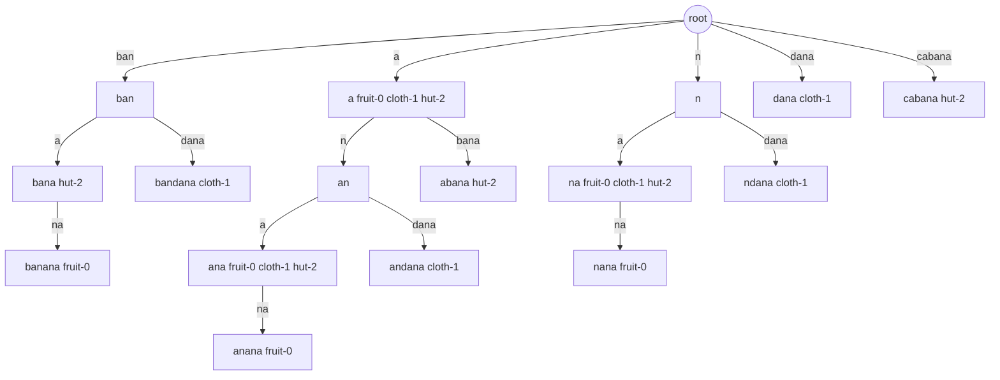

# Generalized Suffix Tree

[](https://github.com/mezz/generalized-suffix-tree/actions/workflows/verify.yml)
[](https://central.sonatype.com/artifact/net.mezzdev/suffixtree)

## What It Does

`suffixtree` is a Java library for exact substring lookup over many strings.

Add a key/value pair with `put(key, value)`, then search for any substring of that key. If a key contains the search token, the associated value is returned.

This README focuses on `GeneralizedSuffixTree`, the mutable online index in this artifact.

Two lookup styles are available:

```java
Set<T> results = tree.getSearchResults(token);

tree.getSearchResults(token, resultsCollection -> {
    // Consume each collection of matching values as the tree is traversed.
});
```

`getAllElements()` returns all indexed values. The convenience methods return identity sets, so result de-duplication is based on object identity (`==`), not `equals`. If the same value object is indexed under multiple matching keys, it appears once. If two distinct objects compare equal with `equals`, both can appear.

Result iteration order is intentionally unspecified.

## Coordinates

```xml
<dependency>
  <groupId>net.mezzdev</groupId>
  <artifactId>suffixtree</artifactId>
  <version>1.4.0</version>
</dependency>
```

## Examples

For the examples below, assume this index:

```java
import net.mezzdev.suffixtree.GeneralizedSuffixTree;

import java.util.Set;

GeneralizedSuffixTree<String> tree = new GeneralizedSuffixTree<>();
tree.put("banana", "fruit-0");
tree.put("bandana", "cloth-1");
tree.put("cabana", "hut-2");

Set<String> results = tree.getSearchResults("ana");
```

Returned values are shown as sets because iteration order is unspecified.

| Query token | Returned values | Notes |
| --- | --- | --- |
| `ana` | `{fruit-0, cloth-1, hut-2}` | Found wherever the exact substring appears. |
| `ba` | `{fruit-0, cloth-1, hut-2}` | Found at the start of `banana` and `bandana`, and inside `cabana`. |
| `bana` | `{fruit-0, hut-2}` | `banana` starts with it; `cabana` contains it; `bandana` does not. |
| `nda` | `{cloth-1}` | Matches a middle substring in one key. |
| `bandanas` | `{}` | Longer than any matching substring in the indexed keys. |
| `ANA` | `{}` | Matching is case-sensitive. |
| empty string | `{}` | Empty search tokens return no results. |

Search is case-sensitive. Normalize keys and tokens before inserting/searching if you need case-insensitive behavior.

Keys are indexed independently. If a tree contains `"abc" -> "first"` and `"def" -> "second"`, searching for `cd` returns no results even though `c` ends one key and `d` begins the next key.

For lower-allocation or streaming use cases, use the callback form:

```java
tree.getSearchResults("ana", matchingValues -> {
    for (String value : matchingValues) {
        // process value
    }
});
```

For runtime-only data, a key/value association can be removed when it should stop appearing in search results:

```java
tree.remove("banana", "fruit-0");
```

Removal is intentionally limited. It uses the supplied key to remove the value from matching result payloads, but deliberately leaves existing nodes, compressed edges, and suffix links in place. It does not keep a separate deletion index. Prefer distinct value identities for independently removable runtime entries; removing one key for a value can affect search results for that same value under overlapping keys.

## When To Use It

Use `GeneralizedSuffixTree` when:

- You need exact substring search, not token search or fuzzy matching.
- You need to add keys incrementally at runtime.
- You want one index over many strings.
- Broad partial searches are expected and returning many matching values is acceptable.

## When Not To Use It

This library does not provide:

- Ranking or scoring.
- Fuzzy search.
- Locale-aware matching.
- Tokenization.
- Case folding.
- Reclaiming or compacting tree structure after removal. Use a new tree or rebuild if removed runtime entries must release their old tree nodes and edges.
- Match positions, spans, offsets, or per-occurrence results.

If your data is fully static and build-once lookup is the only requirement, a baked immutable index may be a better fit than a mutable online suffix tree.

## What A Generalized Suffix Tree Is

A suffix tree stores paths for the suffixes of indexed strings so substring queries can be answered by walking the query through the tree. A generalized suffix tree extends that idea from one string to many strings, returning the values associated with all keys that contain the query.

This implementation is based on Ukkonen's online suffix tree construction algorithm. It uses compressed edge labels, so an edge can represent multiple characters. No two outgoing edges from the same node start with the same character.

For a single key, such as `banana`, the relevant suffixes are:

```text
banana
anana
nana
ana
na
a
```

Every substring of `banana` is a prefix of at least one of those suffixes. For example, `ana` is a prefix of `anana` and `ana`; `bana` is a prefix of `banana`; `nda` is not a prefix of any suffix and therefore is not a substring of `banana`.

A generalized suffix tree does the same thing for many keys and stores value references on the paths that can answer searches. Conceptually, after adding the three example keys, the tree can answer these substring-to-value relationships:

```text
"ana"  -> fruit-0, cloth-1, hut-2
"ba"   -> fruit-0, cloth-1, hut-2
"bana" -> fruit-0, hut-2
"nda"  -> cloth-1
```

That table is not a separate map stored by the implementation; it is the observable result of walking compressed suffix-tree edges and collecting values below the matched path.

The compact diagram below shows the final compressed search-edge graph for the example keys. Edge labels are compressed edge labels. Node labels show the full path from the root and any values stored directly on that node. Direct node values are not always the full search result; search also collects values below the matched node.



For the full step-by-step build diagrams, including suffix-link views after each insertion, see [Implementation Notes](docs/implementation.md).

For a lookup such as `bana`, search walks the tree from the root by matching the query against edge labels:

```text
query: "bana"

walk compressed edges from the root
  match "b"
  then "a"
  then "n"
  then "a"

matched query path
  collect values stored at and below that path

returned values include:
  {fruit-0, hut-2}
```

The value for `bandana` is not returned because `bandana` contains `ban` and `ana` separately, but it does not contain the exact substring `bana`.

Because edge labels are compressed, the real path may not have one node per character. A query can finish in the middle of an edge label; the implementation still collects the values below that matched implicit path.

## Why A Mutable Online Index

`GeneralizedSuffixTree` supports adding keys incrementally. That is the main reason to use it over a baked immutable index.

Ukkonen's algorithm allows the tree to be updated as characters are processed, so callers can keep calling `put` as new keys become available. The tradeoff is that the tree remains mutable. Do not treat it as a lock-free shared read-only structure while another thread may mutate it.

## Complexity And Memory

Let:

- `N` be the total indexed input size: the total number of UTF-16 code units across indexed keys, plus one entry slot
  per key/value pair.
- `m` be the query token length.

| Operation | Cost | Comment |
| --- | --- | --- |
| Build index | `O(N)` amortized | Adds keys online using Ukkonen's algorithm. |
| Built memory | `O(N)` | Stores compressed edges, nodes, suffix links, cache state, and value references. |
| Lookup | `O(m + N)` | Walks the query path, then may visit a large matched subtree for broad queries. |

Build time is amortized-linear because Ukkonen's algorithm updates the tree as characters are processed. This is why the
structure is useful as an online index: adding another key updates the existing tree instead of rebuilding a global
baked structure.

The memory bound has a larger constant factor than a plain list of strings because the tree keeps compressed edge
labels, nodes, edge references, suffix links, repeated-key cache state, and value references attached to matched paths.
It is still `O(N)` because the number of retained nodes and value references grows linearly with the indexed input.

Empty tokens return immediately. Non-empty queries first traverse the query token through compressed edge labels. If the
query path does not exist, lookup stops after that `O(m)` traversal. If it does exist, the tree walks the matched subtree
and de-duplicates returned value identities while collecting results. Result collection is included in the `O(N)` part
of the lookup bound because a broad query can match a subtree containing a large part of the index.

Short or common queries like `a` can approach the worst case because they may touch a large subtree and return many
values. Longer or more selective queries such as `bana` usually walk a much smaller subtree.

## Unicode

Matching uses exact Java `String` substring semantics over UTF-16 code units. The library does not perform Unicode normalization, locale-aware comparison, case folding, tokenization, stemming, or code-point-aware segmentation.

## Thread Safety

`GeneralizedSuffixTree` has no internal synchronization.

Do not call `put` concurrently with another `put` or with search. If a tree is shared across threads, use external synchronization around mutation and publication. Treat read-only sharing as requiring the same normal Java safe-publication care as any other mutable object.

## References

- Esko Ukkonen, "On-line construction of suffix trees," *Algorithmica* 14, 249-260, 1995. DOI: https://doi.org/10.1007/BF01206331
- DBLP record: https://dblp.org/rec/journals/algorithmica/Ukkonen95

## Build

Run tests:

```bash
./mvnw test
```

Run the normal verification build:

```bash
./mvnw verify -Dgpg.skip
```

Build the benchmark jar:

```bash
./mvnw clean package -Pbenchmark
```

Run the JMH benchmark jar with GC profiling:

```bash
java -jar target/benchmarks.jar -prof gc
```

## License

This project is released under the Apache License 2.0. See [LICENSE.txt](LICENSE.txt).
