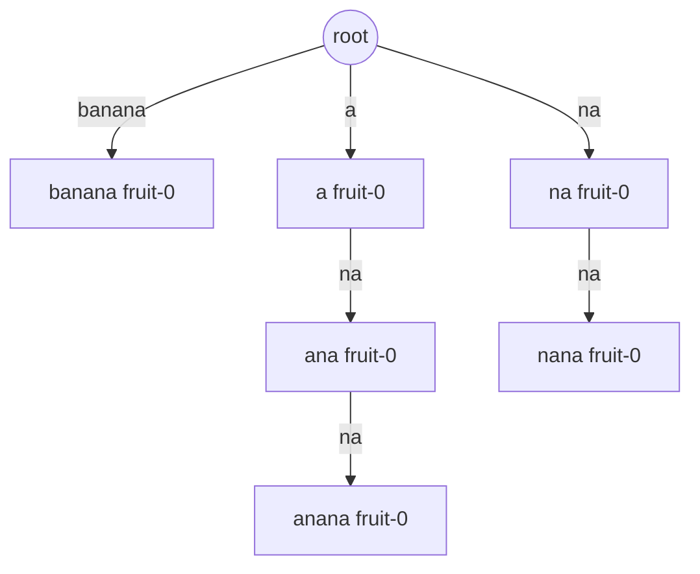
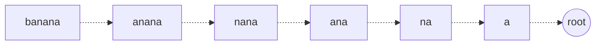
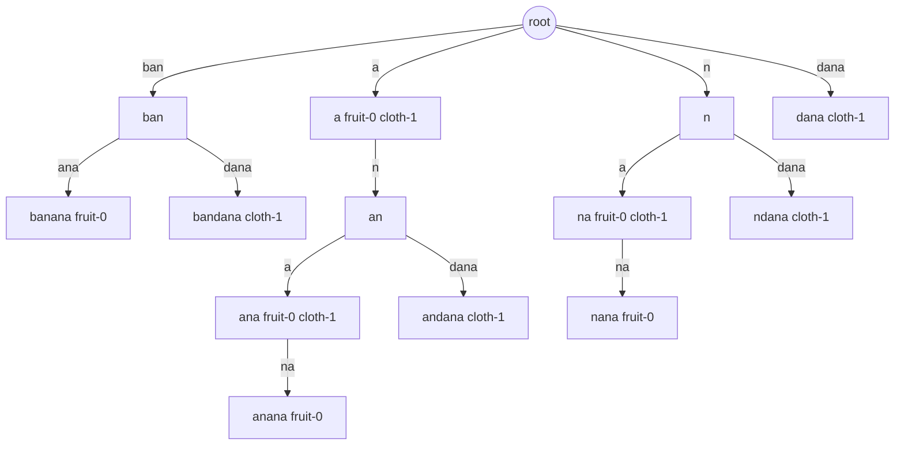
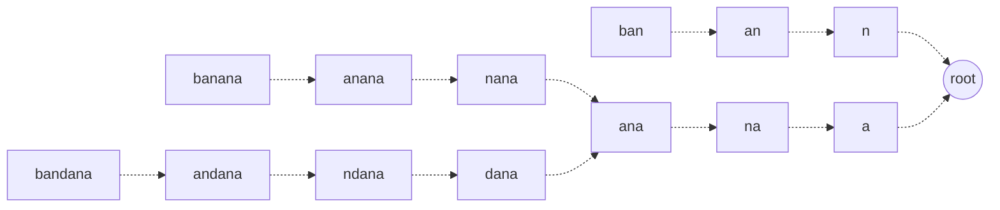
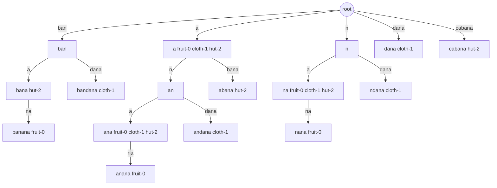
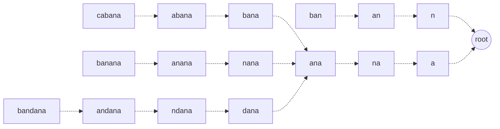

# Implementation Notes

This page shows the example `GeneralizedSuffixTree` build from the README in more detail.

The example inserts three key/value pairs:

```java
GeneralizedSuffixTree<String> tree = new GeneralizedSuffixTree<>();
tree.put("banana", "fruit-0");
tree.put("bandana", "cloth-1");
tree.put("cabana", "hut-2");
```

The diagrams were translated from `tree.printTree(out, true)` output for the same insertions.

The regular view shows compressed search edges. The suffix-link view shows construction links used by Ukkonen's algorithm. Suffix links point from a path to the node representing the same path with its first character removed.

Node labels use compact text such as `banana fruit-0`. The path name comes first; any directly stored values follow it. Direct node values are not always the full search result, because search also collects descendant values below the matched node.

## After `banana`

### Regular View



### Suffix-Link View



## After `bandana`

### Regular View



### Suffix-Link View



## After `cabana`

### Regular View



### Suffix-Link View



## Reading The Diagrams

Search only follows the regular compressed edges from the root. For example, searching `bana` starts from the root, follows the `ban` edge, then matches the first character of the `a` edge below it. The query can finish in the middle of a compressed edge; the implementation still collects values below the matched implicit path.

Suffix links are construction shortcuts. They are used while adding text so the algorithm can move from one active suffix state to the next without restarting from the root each time. They are not followed by `getSearchResults`.
